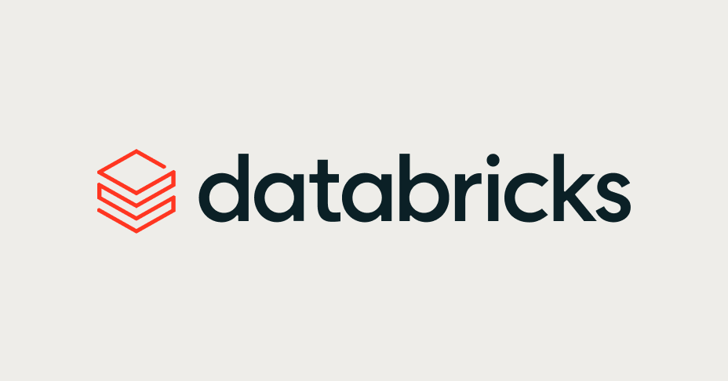

<p align="center">
  
</p>

<h1 align="center">HL7 Real-Time Intelligence Demo</h1>

<p align="center">
  One Databricks App streams synthetic HL7 v2 events
  <b>Zerobus → bronze → silver → Lakebase serving</b>,
  with per-hop and end-to-end latency live on one screen.
</p>

---

This demo shows off the **flexibility, performance, and scalability** of Databricks
pipelines on a live HL7 feed:

- **Flexibility** — swap the front door, keep the house. Pick your ingestion path in the
  app — **Zerobus Direct Write** or **Azure Event Hubs** (Kafka endpoint) — and only *how*
  records reach bronze changes; everything downstream is one shared pipeline and one set
  of tables.
- **Performance** — every hop is measured. Per-hop and end-to-end latency stream to the
  dashboard at 1 Hz, so you watch generate → land → parse → serve in real time.
- **Scalability** — the serverless DLT medallion uses enhanced, streaming-aware
  autoscaling, so throughput tracks the ingest rate and the backlog stays at zero.

## Architecture

```
HL7 generator (app)  ──┬── Zerobus Direct Write (REST) ─────────────┐
                       │                                            │
                       └── Azure Event Hubs (Kafka) ── DLT source ──┤
                                                                    ▼
  bronze_hl7_raw            ← MANAGED Delta landing table
      │
      │  serverless Lakeflow Declarative Pipeline (DLT), enhanced autoscaling
      ▼
  silver_hl7_parsed         ← STREAMING TABLE (DLT-managed)  ── valid, parsed HL7
  silver_hl7_quarantine     ← STREAMING TABLE (DLT-managed)  ── malformed, classified
      │
      │  DLT foreach_batch_sink → psycopg upsert
      ▼
  Lakebase (Postgres)       ← rt_latest_transactions, rt_stage_metrics
      │
      ▼
  Dash dashboard (1 Hz)
```

The medallion is a **serverless DLT pipeline** (`hl7-rti-medallion-dlt`) — enhanced
autoscaling reacts to streaming backlog, so throughput tracks the ingest rate and the
queue stays at zero. Silver is materialized as **streaming tables** DLT owns end to end.

- **Pipeline:** `resources/dlt_pipeline.yml`, `pipelines/dlt/medallion_dlt.py`
- **Serving sink:** `pipelines/dlt/lakebase_sink.py`
- **App:** `app/` (Dash, served by gunicorn)
- **Config:** catalog `real_time_mode_demo_catalog`, schema `rti_demo` (see `databricks.yml`)

---

## Query the data directly — full unification across the board

The demo is more than the app: the same live records are queryable **at every layer**
— the raw Delta landing table, the DLT-managed **streaming tables**, and the Lakebase
Postgres serving layer. Every query below is run against the live demo.

> **Notebook:** the UC queries below are also in `notebooks/hl7_rti_queries.py` (synced
> to the workspace by `bundle deploy`), with `catalog` / `schema` widgets that default to
> the demo's values — just attach and run.

> UC tables (`bronze_*`, `silver_*`) → any SQL warehouse / notebook on catalog
> `real_time_mode_demo_catalog`, schema `rti_demo`.
> Lakebase tables (`rt_*`) → the Postgres serving endpoint (psql / any Postgres client).

### 1. Bronze — latest raw messages as they land (Delta)

```sql
SELECT event_id, source_path, message_type, ts_generated, ts_bronze
FROM real_time_mode_demo_catalog.rti_demo.bronze_hl7_raw
ORDER BY ts_bronze DESC
LIMIT 10;
```

### 2. Silver — latest parsed records (DLT streaming table)

`silver_hl7_parsed` is a **STREAMING_TABLE** — DLT owns and continuously materializes
it. You query it exactly like any table:

```sql
SELECT event_id, facility_id, message_type, unit, patient_mrn, ts_bronze, ts_silver
FROM real_time_mode_demo_catalog.rti_demo.silver_hl7_parsed
ORDER BY ts_silver DESC
LIMIT 10;
```

Malformed messages are routed (not dropped) to a parallel streaming table:

```sql
SELECT event_id, error_code, error_detail, ts_silver
FROM real_time_mode_demo_catalog.rti_demo.silver_hl7_quarantine
ORDER BY ts_silver DESC
LIMIT 10;
```

### 3. Unification — trace one event bronze → silver with per-hop latency

Join the raw landing table to the streaming table on `event_id` to reconstruct each
record's journey and measure every hop in milliseconds:

```sql
SELECT b.event_id,
       b.source_path,
       b.message_type,
       (unix_millis(s.ts_bronze) - unix_millis(b.ts_generated)) AS bronze_ms,  -- generate → land
       (unix_millis(s.ts_silver) - unix_millis(s.ts_bronze))    AS silver_ms,  -- land → parsed
       (unix_millis(s.ts_silver) - unix_millis(b.ts_generated)) AS e2e_ms      -- generate → silver
FROM real_time_mode_demo_catalog.rti_demo.bronze_hl7_raw   b
JOIN real_time_mode_demo_catalog.rti_demo.silver_hl7_parsed s USING (event_id)
ORDER BY s.ts_silver DESC
LIMIT 10;
```

### 4. Reconcile counts across layers

Bronze and silver stay within a few hundred rows of each other — that gap *is* the
in-flight backlog. Quarantine holds whatever failed parse/validate:

```sql
SELECT 'bronze_hl7_raw'        AS layer, count(*) AS rows FROM real_time_mode_demo_catalog.rti_demo.bronze_hl7_raw
UNION ALL SELECT 'silver_hl7_parsed',     count(*)        FROM real_time_mode_demo_catalog.rti_demo.silver_hl7_parsed
UNION ALL SELECT 'silver_hl7_quarantine', count(*)        FROM real_time_mode_demo_catalog.rti_demo.silver_hl7_quarantine
ORDER BY rows DESC;
```

### 5. Live clinical view off the streaming table

The streaming table is queryable for real analytics, not just plumbing — e.g. a live
per-facility census (admits vs. discharges) over the last 5 minutes:

```sql
SELECT facility_id,
       count(*)                                          AS msgs,
       sum(CASE WHEN message_type = 'ADT^A01' THEN 1 END) AS admits,
       sum(CASE WHEN message_type = 'ADT^A03' THEN 1 END) AS discharges
FROM real_time_mode_demo_catalog.rti_demo.silver_hl7_parsed
WHERE ts_silver > current_timestamp() - INTERVAL 5 MINUTES
GROUP BY facility_id
ORDER BY facility_id;
```

### 6. Lakebase serving — latest served rows + freshness (Postgres)

The serving layer the dashboard reads. Connect with an OAuth token minted from the
Lakebase endpoint (`databricks postgres generate-database-credential
projects/rti-demo/branches/production/endpoints/primary` — use the token as the
Postgres password):

```sql
-- latest served transactions, their end-to-end latency, and how fresh they are
SELECT event_id,
       source_path,
       message_type,
       round(EXTRACT(EPOCH FROM (ts_silver   - ts_generated)) * 1000) AS e2e_ms,
       round(EXTRACT(EPOCH FROM (now()       - ts_lakebase)))         AS age_s
FROM rt_latest_transactions
ORDER BY ts_lakebase DESC
LIMIT 10;
```

### 7. Lakebase serving — live throughput + latency (Postgres)

Per-micro-batch metrics the DLT sink writes, rolled up over the last minute — the same
numbers the stage rail shows:

```sql
SELECT count(*)                    AS batches,
       sum(rows_written)           AS rows_last_60s,
       round(avg(e2e_p50_ms))      AS e2e_p50_ms,
       round(avg(e2e_p95_ms))      AS e2e_p95_ms,
       round(avg(bronze_ms))       AS bronze_ms,    -- generate → land
       round(avg(silver_ms))       AS silver_ms,    -- land → parsed
       round(avg(lakebase_ms))     AS lakebase_ms   -- parsed → served
FROM rt_stage_metrics
WHERE batch_ts > now() - interval '60 seconds';
```

Connect from a shell:

```bash
export PGPASSWORD="$(databricks postgres generate-database-credential \
  projects/rti-demo/branches/production/endpoints/primary \
  -p fe-vm-real-time-mode-demo -o json | jq -r .token)"

psql "host=ep-steep-mountain-d2c3ahvt.database.us-east-1.cloud.databricks.com \
      port=5432 dbname=rti_demo user=<your-workspace-email> sslmode=require"
```

---

## Live results (validated)

Serverless DLT with enhanced autoscaling vs. the retired classic-compute job:

| Metric | Classic compute | Serverless DLT |
|---|---|---|
| Backlog | 2.6M rows, building | **0** |
| Serving freshness | 100–700 s | **~2 s** |
| E2E p50 / p95 | 55–290 s | **~5 s / ~7 s** |
| Throughput | stuck ~110/s (2 workers) | **tracks ingest, backlog 0** |
| Autoscaling | ignored streaming backlog | streaming-aware, always-on |

## Run it

```bash
# validate + deploy the bundle (provisions the DLT pipeline + app)
databricks bundle validate -p fe-vm-real-time-mode-demo
databricks bundle deploy   -p fe-vm-real-time-mode-demo

# reset to a clean slate before a demo (bronze + serving tables; DLT full-refresh)
python scripts/reset_demo.py --profile fe-vm-real-time-mode-demo --full-refresh

# tests
python -m pytest -q
```

`bundle deploy` is idempotent — rerun it any time you change code or resources; it
updates the DLT pipeline and app in place (no need to tear down first). Note the
reset script takes `--profile` (not `-p`). Run `reset_demo.py` without
`--full-refresh` to clear bronze + serving tables only, leaving DLT state intact.

See `spec/hl7-rti-demo-spec-v4.md` for the full build spec and
`docs/dlt-migration-plan.md` for the DLT migration rationale.
